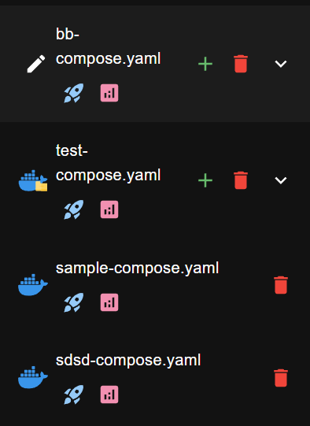
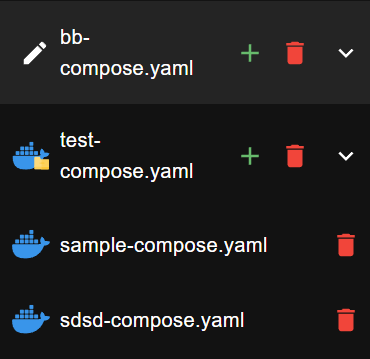

:::info
This feature is only available on `ghcr.io/ra341/dockman:canary` build
and is unreleased at the moment.
:::

You can enable or disable quick actions in your compose files.

To toggle this feature, add the following to your `.dockman.yml` file:

```yaml title=".dockman.yml"
disableComposeQuickActions: true # disables the quick actions
```

### Example

| With Compose Actions                          | Without Compose Actions                                           |
|-----------------------------------------------|-------------------------------------------------------------------|
|  |  |
