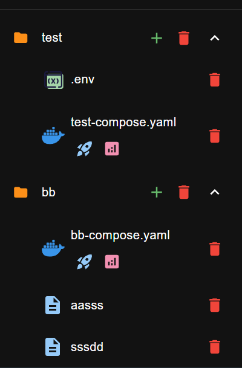

:::warning
This feature is only available on ```ghcr.io/ra341/dockman:main``` tag only
and is currently in testing expect bugs

:::

`.dockman.yaml` file is an optional configuration file that allows you to customize your dockman instance.

## Pinning folders/files

You can pin specific files or directories to appear at the top of your file list for quick access.

The specified files and directories will appear at the top of your file list, followed by the normal
alphabetical sorting.

Create either `.dockman.yaml` or `.dockman.yml` in your compose root.

Add a `pinnedFiles` section with the names of files or directories you want to pin:

```yaml title=".dockman.yml"
pinnedFiles:
  router: 1 # <- indicates priority
  media: 2
  arr-compose.yaml: 3
```

With the configuration above, your file list will show:

```
1. router/ (pinned)
2. media/ (pinned)
3. arr-compose.yaml (pinned)
4. Other files in normal sort order
```

## Compose Folders

Dockman can give folders a special **compose view**.
If a folder contains a **single file named `compose.yaml`**, it can be promoted to a *compose folder*.

This doesn’t change the actual files on disk, your folder and file still exist the same way,
it just changes how Dockman displays them for faster access.

If the folder **doesn’t contain a `compose.yaml` file** or contains **multiple files**, it will be shown as a normal
folder.

### Enabling Compose Folders

To turn this on, add the following to your `.dockman.yml` file:

```yaml title=".dockman.yml"
useComposeFolders: true
```

### Example

| Normal Folders                                  | Compose Folders                       |
|-------------------------------------------------|---------------------------------------|
|  |  |
