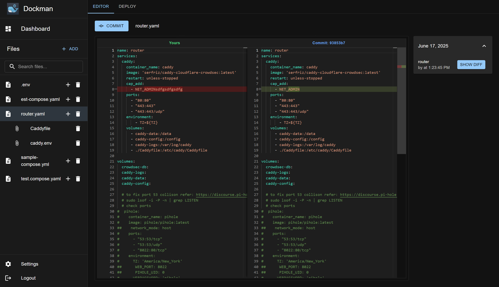

# Dockman

**⚠️ Warning: Dockman is still under development. While it works (I'm personally using it to manage my server), expect
bugs and breaking changes.**

Dockman is a tool designed to simplify the management of Docker Compose files,
particularly for homelab environments.
It provides a straightforward way to edit, track, and back up your compose configurations.

## Screenshots





## Contents

- [Install](#Install)
- [WIP Features](#wip-features)
- [Why](#why-dockman)
    - [How It Compares](#how-it-compares)
- [Feedback](#feedback)
- [Contributing](#contributing)
- [License](#license)

## Install

Get Dockman up and running with the Docker Compose configuration below.

**Critical**: The stacks directory path must be identical in all three locations:

* 1️⃣ The host side of the volume `/path/to/stacks`
* 2️⃣ The container side of the volume `/path/to/stacks)`
* 3️⃣ Environment variable: `DOCKMAN_COMPOSE_ROOT=/path/to/stacks`

This path consistency is essential for Dockman to properly locate and manage your compose files.

```yaml
services:
  dockman:
    container_name: dockman
    image: ghcr.io/ra341/dockman:dev
    environment:
      # 1️⃣
      - DOCKMAN_COMPOSE_ROOT=/path/to/stacks
    volumes:
      #  2️⃣              3️⃣                
      - /path/to/stacks:/path/to/stacks
      - /var/run/docker.sock:/var/run/docker.sock
    ports:
      - "8866:8866"
    restart: always
```

### Example with Actual Path

Replace `/path/to/stacks` with your actual directory path:

```yaml
services:
  dockman:
    container_name: dockman
    image: ghcr.io/ra341/dockman:dev
    environment:
      - DOCKMAN_COMPOSE_ROOT=/home/user/docker-stacks
    volumes:
      - /home/user/docker-stacks:/home/user/docker-stacks
      - /var/run/docker.sock:/var/run/docker.sock
    ports:
      - "8866:8866"
    restart: always
```

## Getting Help

Need assistance? Open a [discussion on GitHub](https://github.com/RA341/dockman/discussions).


## WIP Features

* **Easy Editing with LSP Support:** Integrated Language Server Protocol (LSP) for enhanced editing features like
  autocompletion and syntax validation.
* **Git Tracking:** Built-in Git support to track changes in your compose files, providing version history and easy
  rollbacks.
* **Painless Backup/Restore:** Simple, reliable commands for backing up and restoring your entire Docker Compose setup
  using git.

## Why Dockman

I built Dockman to solve a specific problem in my homelab setup. While there are excellent Docker management tools
available, none quite matched how I prefer to work.

Dockman is designed for people who:

- Prefer editing configuration files directly over GUI abstractions
- Want a clean, focused interface without unnecessary complexity
- Value simplicity and purpose over comprehensive feature sets

If this resonates with your workflow, I'd appreciate a star.
Even if it doesn't fit your needs, I'd welcome your [feedback](#feedback) to help improve it.

## How It Compares

**vs. [Portainer](https://github.com/portainer/portainer)**: Dockman delivers a focused, minimalist experience designed
for homelabs. If you find Portainer's extensive feature set overwhelming and prefer a streamlined interface dedicated
specifically to compose file management, Dockman might be your solution.

**vs. [Dockge](https://github.com/louislam/dockge)**: The fundamental difference lies in editing philosophy. Dockman
embraces direct compose file editing—like working with your favorite text editor. Instead of UI-generated code, you get
hands-on control over your configurations.

The project takes inspiration from both these excellent tools.

## Feedback

This project is in early stages, so any and all feedback is a huge help.
If you spot a bug, have an idea for a feature, or just want to share your thoughts, please open an issue.

I'd especially love to hear what you think about a couple of things:

* The File and Folder Structure

* The UI
    * I'm not a UI expert, in fact I hate HTML/CSS in general. The current interface is mostly built using Material-UI
      and
      Gemini.
    * If you have ideas on how to make it look better or easier to use, I'm all ears. Feel free to open an issue with
      your suggestions.

## Contributing

Dockman is built with Go for the backend and React for the frontend.

### Project Structure

- **[backend](backend)**: The Go backend service
    - **[spec](spec)**: Proto files for the Connect-RPC API [more info](spec/readme.md).
- **[frontend](ui)**: The React frontend application
- **[install](install)**: Installation scripts and documentation (WIP)

### Getting Started

Before contributing, make sure you have:

- Go 1.24+ installed
- Node.js 22+ and npm/yarn
- Docker for testing/updating generated code

### How to Contribute

Whether you're fixing a bug, adding a feature, or improving documentation:

1. **Start with an issue** - Open an issue first to discuss your idea
2. **Fork and branch** - Create a feature branch from `main`
3. **Submit a PR** - Include a clear description of what you've changed

### Questions?

Not sure where to start? Open an issue tagged with `question` or `help wanted`. I'm happy to help guide new contributors
through the codebase.

## License

This project is licensed under the GNU General Public License v3.0. See the [LICENSE](LICENSE) file for details.
