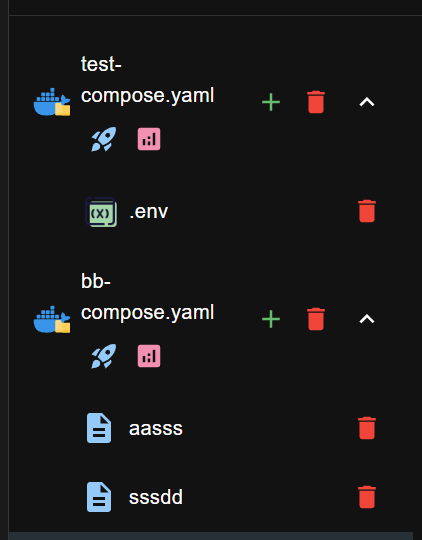

# Compose Folders

Dockman can give folders a special **compose view**.
If a folder contains a **single file named `compose.yaml`**, it can be promoted to a *compose folder*.

This doesn’t change the actual files on disk, your folder and file still exist the same way,
it just changes how Dockman displays them for faster access.

If the folder **doesn’t contain a `compose.yaml` file** or contains **multiple files**, it will be shown as a normal
folder.

### Enabling Compose Folders

To turn this on, add the following to your `.dockman.yml` file:

```yaml title=".dockman.yml"
useComposeFolders: true
```

### Example

| Normal Folders                                  | Compose Folders                       |
|-------------------------------------------------|---------------------------------------|
|  |  |
